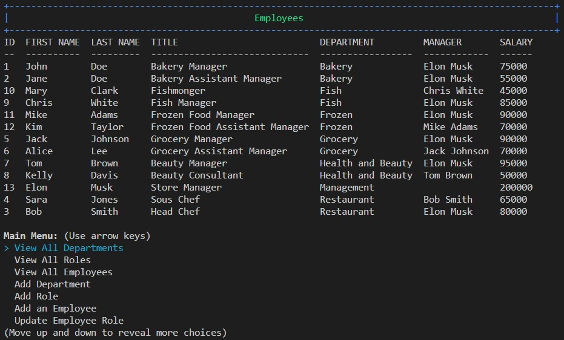

# Employee Tracker
  
  
## Description
This is a command-line interface (CLI) application that lets you manage departments, roles, and employees in a company. With this program, you can:

- View all departments, roles, and employees
- Add a new department, role, or employee
- Update an existing department, role, or employee
- Delete a department, role, or employee
  
The program uses Node.js and MySQL for the backend, and Inquirer.js for the CLI interface. The database schema consists of three tables: department, role, and employee, which are related through foreign keys. The program provides a menu-based interface that guides you through the various options.

## Installation
To use the program, you'll need to have Node.js and MySQL installed on your computer, and create a database and schema using the provided SQL script. Then, you can run the program with the command node index.js in your terminal.

## Usage
Can be utilized to manage a team of departments, roles and its employees.

## Screenshot of the application

## Skills on display
- MySQL 
  - select
  - delete
  - update
- Inquirer Promts
- Password protection using dovenv
- Promise functions
- cTable to console log database content in a table format
- cliBoxes to create headers for the application

## Walkthrough Video
https://youtu.be/4Jjsw9MKB20

